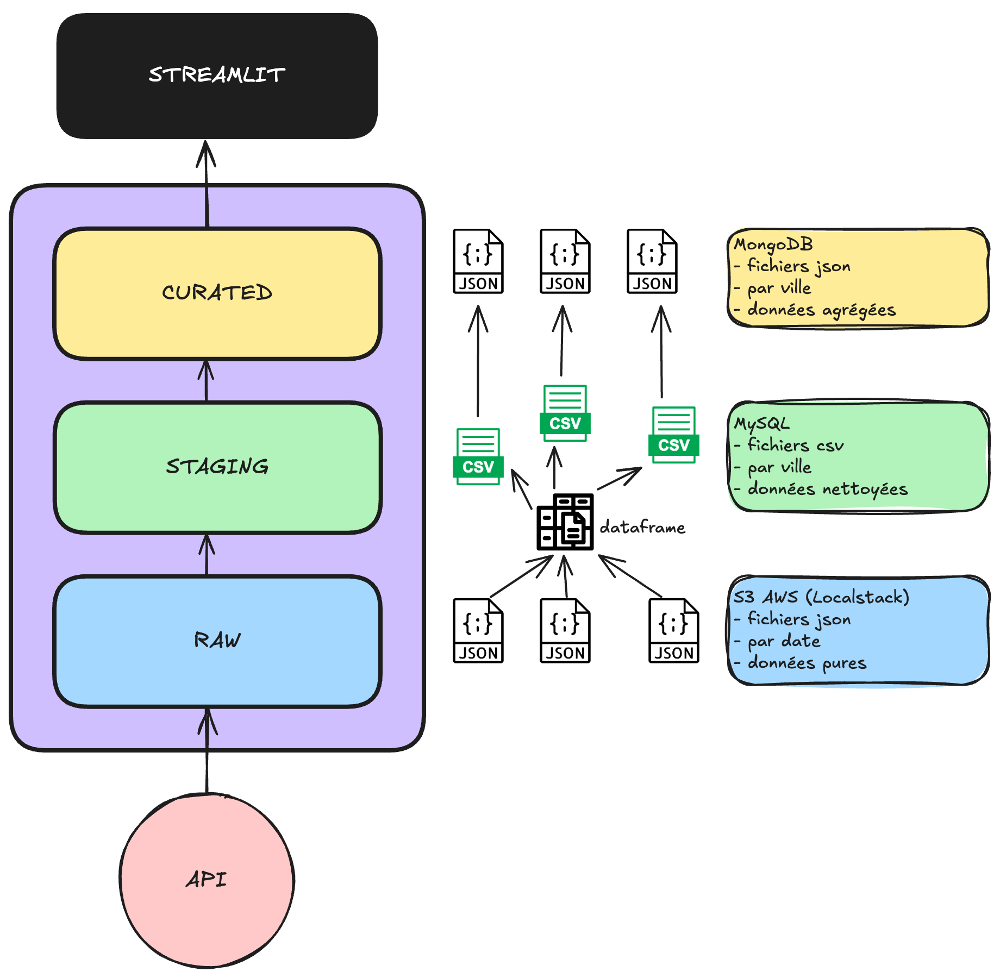

# Introduction
Dans le cadre d...

# Architecture


# Explications du code
### `run_big_fetch`: 
On récupère les données météo de décembre 2023 sous format JSON. 
### `run_unpack_to_raw` :
On télécharge les fichiers JSON vers un bucket S3 simulé par LocalStack.
### `run_preprocess_to_staging`: 
- Récupération des fichiers JSON depuis le bucket S3.
- Conversion des fichiers JSON en DataFrames et concaténation des données.
- Filtrage des colonnes pertinentes dans le DataFrame.
- Sauvegarde des données filtrées en fichiers CSV par ville dans un répertoire de staging.
- Insertion des données CSV dans une base MySQL en créant dynamiquement une table par ville.
### `run_process_to_curated`: 
- Connexion à MySQL via **SQLAlchemy** et à MongoDB via **pymongo**.
- Récupération des noms de tables (villes) depuis la base de données staging de MySQL.
- Pour chaque ville, exécution d’une requête SQL pour agréger les données météo (température, pression, vent, pluie) par jour.
- Transformation des données en documents MongoDB avec une structure imbriquée (ex : température, pression, vent, pluie sous des clés distinctes).
- Insertion des documents dans la collection WeatherStats de MongoDB.


# Installation et build du projet
Prérequis : Avoir git et docker installés.
Récupérez le code :
```
git clone ...
```
Démarrer docker
Dans le dossier du projet, construire les containers avec :
```
docker compose up --build -d
```
Vérifier que tous les containers (à part `airflow-init`) tournent bien sur Docker, sinon le relancer la commande.

Accédez à `airflow-webserver` sur `http://localhost:8081`
Voici le couple "identifiant:password" pour accéder au webserver: `airflow:airflow`

Lancer le DAG `datalake-pipeline` et attendez la fin de l'exécution.
(Attention : vérifiez que les données météo sont bien présentes sur : https://public.opendatasoft.com/explore/dataset/donnees-synop-essentielles-omm. Pour une raison qui m'échappe,  il y a parfois des problèmes avec l'API comme des données manquantes).
Vous pouvez vérifier les logs si besoin. Les données météorologiques de décembre 2023 sur plusieurs villes ont été ingérées par notre Datalake.

Accédez à `api` sur `http://localhost:8000` : vous pouvez tester les endpoints.
Il est possible de faire de l'ingestion grâce à l'endpoint `/ingest`. Le fichier `data/ingestion/2024.json` peut être utilisé par exemple.

Le endpoint `/ingest-fast` est plus rapide et performant qu' `/ingest`
Nous comparerons les résultats des tests de performance.

Exécutez la commande suivante pour relancer le container `streamlit`
```
docker compose restart streamlit
```
Accédez à `streamlit` sur `http://localhost:8501`.
Il est possible d'analyser les données météo des villes sur une période donnée. Les métriques sont la températion, la pression, la vitesse du vent et les fortes pluie.

L'installation est terminée. 

Pour unbuild le projet, n'hésitez pas à supprimer les volumes :
```
docker compose down -v
```


# Résultats des tests de performance
ingestion : environ 20 secondes
ingest-fast : environ 8 secondes